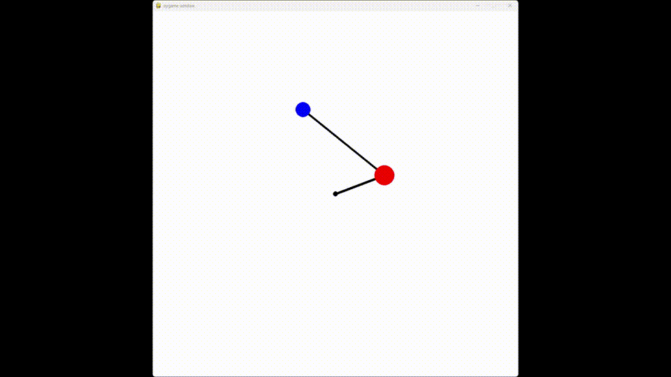
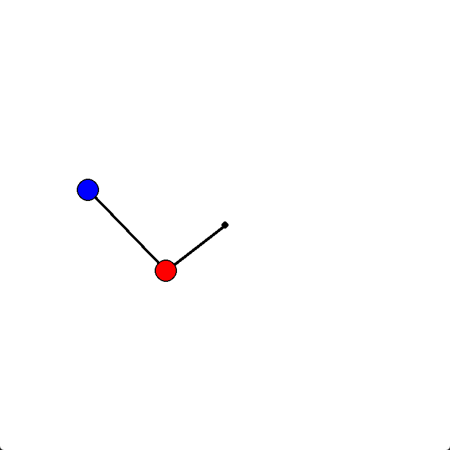

# Double pendulum simulation demo

This is a tiny project, which utilizes my own implementation of Runge-Kutta ODE solver to numerically integrate the dynamics of a double pendulum. The computation is implemented from scratch using *numpy*, rendering is done via *pygame*.

More examples of ODE solvers and their applications can be found in my [Computational Mathematics Repository](https://github.com/tndrd/mipt-comp-math).
The derivation of pendulum's Lagrange equations can be found [here](https://scienceworld.wolfram.com/physics/DoublePendulum.html).

## How to run

### Prerequisites

Install Python dependencies first:

```
pip3 install numpy pygame
```

### Free mode

Execute the following script to simulate pendulum in free environment (no dissipation, external forces, etc.)

```
python3 demo_free.py
```

### Interactive mode

Execute the following script to run an interactive simulation. Press ```[LMB]``` to grab the lower ball, or ```[RMB]``` to grab the upper one. To compensate for the excess energy produced by interaction, a viscous friction was implemented.

```
python3 demo_interactive.py
```


## Demo video



## Demo video #2: 3x speed

